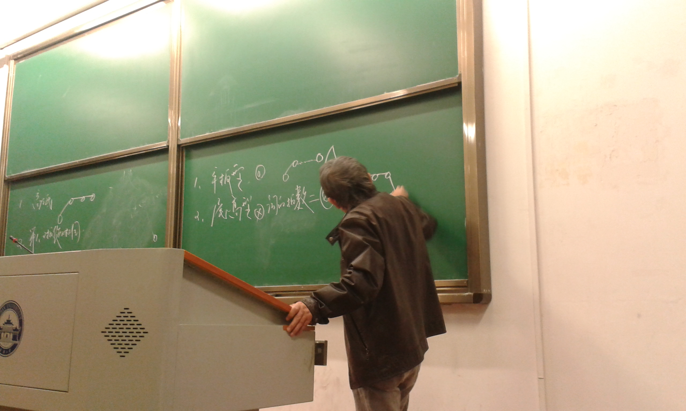
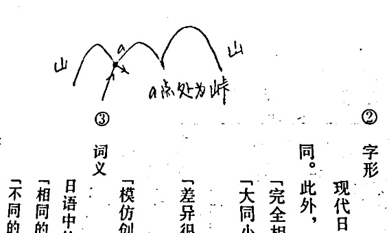
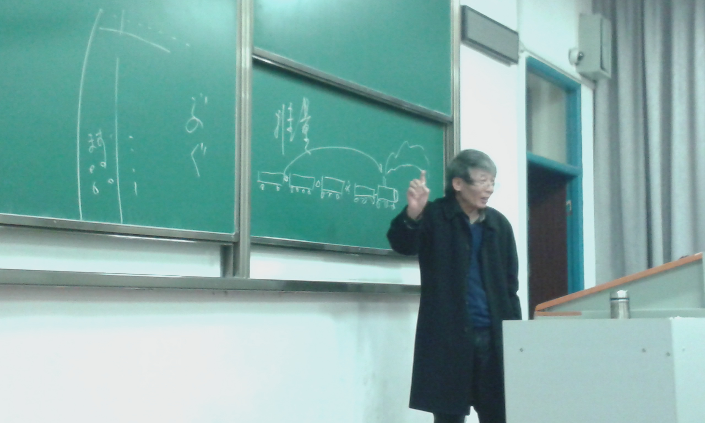
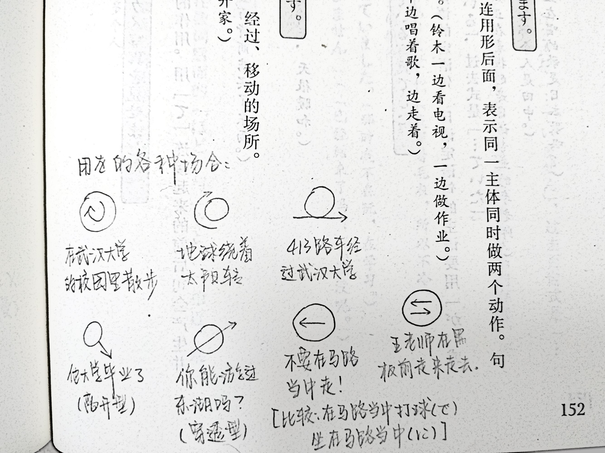
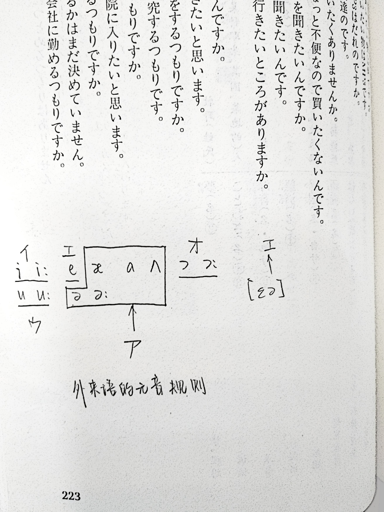
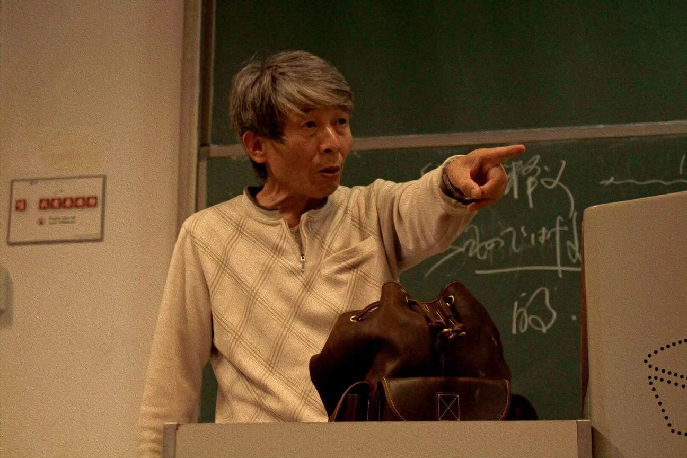

关于王老师的许许多多的故事

# 前言

我选上课的时候，已经是第三周了。我在课间找到老师，说我是新选上课的同学，前面的课没有听。老师说没关系，问我会不会五十音。我说会，老师拿起粉笔就在黑板上用假名写了三个单词，然后用手指着黑板大声说：「读！」

老师说这是与我「过招」。有一个单词不记得了，有一个是[「いっか」]{lang=ja}，还有一个是[「ぎょぎょう」]{lang=ja}。前面两个单词都顺利读出来了，后面那个[「ぎょぎょう」]{lang=ja}，现在想来，是想考我鼻浊音。当时没见过这么奇怪的词，要是写成汉字的[「漁業」]{lang=ja}，我第一反应一定会是[「ギョゲフ」]{lang=ja}吧（笑）。

这个故事告诉我们：这个日语笔记，是从第三周开始的。

既然是笔记，也不能什么都记下来，那样服务器会装不下的（服务器：我有 25G 磁盘呢文本文件怎么装也装得下啊！），所以那些考试的重点内容就不记下，只把有趣的故事记录下来。

这个想起来就会更新的～

补充：现在服务器有 50G 磁盘了（笑）

补充：现在公开到 GitHub Pages 了，不需要服务器了

补充：现在用 Vercel，不用 GitHub Pages 了

补充：现在用回 GitHub Pages 了

补充：因为 GitHub Pages 没有 IPv6，所以现在用回自己的服务器 + Cloudflare 了

补充：现在改用 GitHub Pages + Cloudflare 了

# 也谁も谁一把

（新编日语 p27）

日语的「も」是「也谁も谁一把」。比汉语精确，比如汉语「他也在教室吃苹果」有歧义：

:::{lang=ja}
1. 彼も教室で林檎を食べます
1. 彼は教室でも林檎を食べます
1. 彼は教室で林檎も食べます
:::

# は和が

这个有很多故事。

## 辨析课

老师说曾经给高年级的日语本科生开「は」和「が」的辨析课，一学期上完了，同学们很高兴：「老师，我终于不怕は和が了！」老师说：「我还怕呢！」

然后老师就说到自己做了一本新出的「は」和「が」的练习帐，做完发现自己竟然错了两道，非常不相信，觉得是答案错了。后来看了答案，又「乖乖地认错了」。

## 同声传译

:::{lang=ja}
* ～**が**あります。
* ～**は**ありません。
:::

这个语法，老师讲自己同声传译的例子，说以前法律系和经济系请日本专家做报告的时候，他就当翻译。有一次报告会上要发资料，人手不够，他就也去帮忙，一边发资料一边随口翻译，把大家都惊呆了。

老师说日语的否定在最后面，但是汉语的否定却在前面，所以同声传译的时候，就必须预先猜出否定的存在，而判断依据就是这个「は」。

## 句子的重心

做主语，用「は」还是「が」？看句子的重心。

<u>&nbsp;&nbsp;&nbsp;&nbsp;&nbsp;</u>は<u>&nbsp;&nbsp;!&nbsp;&nbsp;</u>。

<u>&nbsp;&nbsp;!&nbsp;&nbsp;</u>が<u>&nbsp;&nbsp;&nbsp;&nbsp;&nbsp;</u>。

例如：

:::{lang=ja}
—— どこ**が**あなたたちの教室ですか。／あなたたちの教室**は**どこですか。

—— ここ**が**わたしたちの教室です。／わたしたちの教室**は**ここです。
:::

## 眼睛和镜头

(p136)

「は」是眼睛，「が」是镜头。

「が」是对客观事物的描述。

例如：

—— 啊！下雨了！／[あっ、あめ**が**。]{lang=ja}

—— （第二天，站在门口）雨还下吗？／[あめ**は**？]{lang=ja}

## 旧信息的新现实

[これ**が**友達からもらった記念切手です。]{lang=ja}(p281)

这里的が是「旧信息的新现实」。例如：

:::{lang=ja}
* あなたがだれでしたか。
* あなたはだれですか。
:::

与第二句相比，第一句暗含「现在需要想起」之意。

* 这是我男朋友——用は
* 这**就**是我男朋友——用が

第二句暗含听话人预先知道说话人有男朋友。

「が」有「就」的含意，老师说以前教日本人汉语，他们不能理解「就」，老师就从「が」入手，日本学生很快就理解了。

# 日语的声调

书上 (p68) 画了声调图，老师说太麻烦，就把书一合，开始自己讲。

1. 平板型：数字为 0
1. 尾高型：数字等于拍数
1. 中高型：数字是几高到几
1. 头高型：数字为 1

<noscript></noscript>

不能出现「双山头」，即没有「低高低高低」。老师说连日语系的学生也有不注意这一点的，这样的发音「丑」。

# [峠]{lang=ja}

老师说以前一直不知道[「峠」]{lang=ja}到底指的是什么地方，后来有一次路过两个山峰的交界处的最低点，看见有一块写着[「峠」]{lang=ja}的牌子，就顿悟了。

<noscript></noscript>

# 语言的六字要诀

语言的六字要诀：选择、排序、呼应。

老师说日语就像倒着开的火车。

<noscript></noscript>

# 食物

小零食：在中国要吃广东的，在外国要吃日本的。

例如：白色恋人。

老师说中国很多小吃不关注「东西吃完以后」的感觉，比如吃完以后粘在牙齿背面，要用手抠下来，这是很多人不说的事实。

老师说[「武漢大学の学生食堂で、桜園は一番まずい」]{lang=ja}。（现在这食堂关掉了）

老师不喜欢四川菜。

老师推荐成田机场餐馆的「野鸭汤」。

老师推荐京都清酒的牌子[「黄桜」]{lang=ja}。

老师推荐银座的海鲜。

* 作物：[さくもの]{lang=ja}
* 植物：[しょくぶつ]{lang=ja}
* 食物：[しょくもつ]{lang=ja}

# 非科学的客观化

[張さんはたくさんのことを勉強したいと思っています。]{lang=ja}(p227)

[……ています]{lang=ja}可以「客观化」，此处是把不科学的「我知道小张的想法」（你怎么知道别人的想法？）进行客观化使之科学，故称「非科学的客观化」。

# 是不是宾语

思考汉语：

* 下雨，淋雨，走路
* 回答问题，回答他，问问题

补充：坐车，坐车去北京

后来真的在语言学课的课间问了老师：「路」是不是「走」的宾语，语言学老师也说只能说是。

汉语语言学课后补充：这个是汉语语法的特点。因为汉语没有格助词作为标记，所以日语中很多不是宾语的句法成分，在汉语中都被说成宾语。

# [たぶん……でしょう]{lang=ja}句式

(p279)

:::{lang=ja}
* あの人はたぶん明日来ないでしょう。
* 彼女はたぶん一生結婚できないでしょう。
:::

# 痴呆症

老师说他的父亲得了痴呆症，他去医院照顾，有一次院长到病房视察，指着老师说「这是不是昨天进来的那个」。老师想对院长说日语，证明他的思维很正常，转念一想院长会觉得「这人说什么听不懂的东西」，那就更麻烦了。

老师对着镜子看了看自己再看看周围的病人觉得没什么两样，感到很可怕，然后感慨地说能与我们这些「少男少女」在一个课堂里很好，因为这时候他的思维就会非常活跃。

「痴呆」东京用[ばか]{lang=ja}，大阪用[あほう]{lang=ja}。

「痴呆症」是[ちほう]{lang=ja}，但是这个词已经不能用了，要用[「認知障害の方」]{lang=ja}。老师说以前有一本日语词典因为有[「ちほう」]{lang=ja}这个词，后来被人指出这是对残障人士不尊重，就全部召回了。

老师又说以前中国还没有版权意识的时候，很多日语词典都是直接翻印了就卖，所以他现在还有一本那个词典。

老师之感：「趁着年轻，要自己活得有质量。」

# 日语学到位了的标准

相声是日本先有还是中国先有？

听落语、漫才，「他们笑你也笑」，说明日语到位了。

# [耳を傾ける]{lang=ja}

书上 (p313) 有[「耳を傾ける」]{lang=ja}这个单词，解释是「倾听」。老师说按这种解释，说了还是不懂，就把书一合，开始自己讲。

[「耳を傾ける」]{lang=ja}是「倾听群众呼声」的倾听，与[「耳を澄ます」]{lang=ja}不同。

# 作出低姿态

书上 (p320) 有这样的对话：

:::{lang=ja}
—— それはいいアイディアですね。牛どんは日本の人にとても人気がありますよ。

—— そうですか。
:::

这里[「そうですか」]{lang=ja}用得很好，因为「作出低姿态」。这样的词有[「なるほど」]{lang=ja}、[「そうですか」]{lang=ja}、[「それは大変ですね」]{lang=ja}。

「我们大学」：[うちの大学]{lang=ja}（√，好），[われわれの大学]{lang=ja}（×，傲慢）

# 灭火

(p324)

[火を止める]{lang=ja} —— 我妈的事情

[火を消す]{lang=ja} —— 消防员的事情

# 语言和语言的关系

「语言和语言的关系是一种曲折对应的关系」，不能说「倒推法外语」（意指用汉语推外语）。

[静かに笑った]{lang=ja}：**淡淡**地笑了。（不是「安静地笑了」）

[「昨日学校が始まりました」]{lang=ja}不能直译成「昨天学校开始了」，英语 [<q>class is over</q>]{lang=en} 不是「班上的人全死了」。(p163)

# [どうも]{lang=ja}

有领导要老师教他几句日语，老师对他说只用会[「どうも」]{lang=ja}即可：要说你好，就鞠躬说[「どうも」]{lang=ja}；要说谢谢，就鞠躬说[「どうも」]{lang=ja}；要说对不起，就鞠躬说[「どうも」]{lang=ja}……

# と和ば

(p330)

ば：相当于汉语「每……就……」

と：相当于汉语「一……就……」

用ば时，「绝对的客观事件」，「客观描述感强」，「自然规律感强」。时间问题必と：老师一进门就……（と），老师每次进门都……（ば）。「我一喝酒就脸红」：ば - 体质问题，と - 时间问题。

# 同音词

:::{lang=ja}
貴社の記者は汽車で帰社した。

庭には二羽の鶏がいる。
:::

（Windows 10 自带的日语输入法很厉害，两句都能打出来！）

# 乡下人

老师经常说自己是乡下人。

老师说一次去外语大学，有几个女学生以为他不懂日语，在背后用日语议论他，说了他是老头之类的话。老师不高兴，转过拐角叫她们站住，指出她们的语法错误。那几个人听到老师日语非常标准，都惊呆了，问老师是哪里来的，老师说他是「王家屯」来的。

# 显老

一次老师和学生一起去买衣服，看到一件黑色的衣服。学生说这件衣服「显老」，不适合老师穿，老师却说「正合我意」，然后高兴地买了。

# 谁何

老师住在日本的时候，有推销的人上门，刚开始他客气地问[「どなたですか。」]{lang=ja}，那些人还一直打扰他；后来他改说[「だれ？！」]{lang=ja}，推销的人吓得扭头就跑。

这两句话就是「您是哪位？」和「哪个？」（武汉话读，[nā gó]{lang=cmn-Latn}）的区别。

# [主として]{lang=ja}

老师说有一次在日本，听一个留学生用日语做报告，把[「主として」]{lang=ja}读成[「<del class="no-deco">おもとして</del>」]{lang=ja}，台下的日本老师就纠正这个学生应该是[「しゅとして」]{lang=ja}，结果后来这个学生读到同样的词，又读成[「<del class="no-deco">おもとして</del>」]{lang=ja}，反复纠正了几次，这个学生还是读错，让台下的日本老师很不愉快。

# 关西话

老师到日本的一家公司上班，公司职员见他不是日本人，对他说关西话，跟他「过招」，老师也流利地用关西话「接招」。

# 其他

<noscript></noscript>

[「知っています」]{lang=ja}和[「知りません」]{lang=ja}：[<q>I have known</q>]{lang=en} 和 [<q>I don't know</q>]{lang=en}。(p154)

刚开始的时候老师经常吐槽课文情节不科学，是为了拼凑语法而编课文。第 12 课[《試験》]{lang=ja}更不科学，本以为老师还会吐槽，没想到老师只吐槽了一个地方：课文中的老师说[「試験開始の合図があるまで問題用紙を開けないでください」]{lang=ja}，但是在这之前学生已经说[「問題が多いですね」]{lang=ja}，说明学生已经把试题册打开了。之所以没有吐槽其他地方，是因为从这课开始语法就难起来了。

日语的[「研究生」]{lang=ja}是指「旁听生」。如果有人说他是日本的[「研究生」]{lang=ja}，一定不要觉得他很厉害。

[「大きい」]{lang=ja}：物理的数学的大；[「大きな」]{lang=ja}：心理世界的大。

<noscript></noscript>

日语的[「少年」]{lang=ja}只指男性，因此汉语的「少女」比日语更「浪漫」。

もうかったかい（类似于武汉人「到哪儿发财去了？」）：从问候语看价值观的变化。

时间长度：げつ，翻日历：がつ。

<noscript></noscript>

武大 1978 年 13 个系。 

「下午篮球场有篮球比赛，但是现在一个人也没有。」前半句：篮球场 + で，后半句：篮球场 + に。

大阪人：老弱病残专座 -> 爱心座；垃圾箱 -> 护美箱。这样的叫法好听。

<noscript></noscript>
