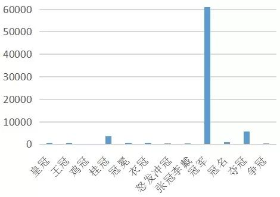

> 同時發佈於知乎：[「新冠病毒」的「冠」是第一聲（guān），然而也習慣念第四聲（guàn）。這是一種什麼音韻學現象？ - 三日月 綾香的回答](https://www.zhihu.com/question/426164493/answer/1652793014){hreflang=zh-CN}

古代的韻書、字書中記載的多音字，隨着語言的演化，逐漸變為只有一個讀音，這種現象非常常見。對於這樣的字，在制訂規範讀音時，就需要在古今讀音之間權衡。周國正《論粵音之規範及其量化》(1994) 中提到：

> 古漢語有一種語法手段，通過語音（特別是聲調）的改變以標示詞性或意義的轉換；而代表不同詞性或意義的兩個詞，有時用同一個字形去代表，「枕」讀上聲是名詞，如「枕頭」；讀去聲時是動詞，如「曲肱而枕之」。「量」讀平聲時是動詞，如「量度」；讀去聲時是名詞，如「數量」。但在漢字一字一音的趨勢下，這種情況就愈來愈少，一字的兩個讀音之中，較多出現的一個會因類推關係而擴充至本來當用另一讀音的場合之中。
>
> 「養」本來有上聲和去聲兩種讀法，表示由上育下的行動時讀上聲，表示自下奉上的行動時讀去聲。但由於「養育」、「教養」、「餵養」、「飼養」、「蓄養」等詞的廣泛使用，令一般人即使在「供養父母」之類本應讀去聲的語句中仍然讀上聲。

下面再以普通話為例，列出十例在古代的韻書、字書中記載為多音字，而在普通話中只有一個讀音的字，並給出這些字在古代有多個讀音的旁證。

一、過。古音古臥切，折合普通話去聲 guò，表示超過，過失，如「過分」、「過期」、「過錯」；又古禾切，折合普通話陰平 guō，表示經過，如「走過」、「錯過」。唐詩「過」多音平聲，杜甫《春宿左省》「花隱掖垣暮，啾啾棲鳥過。星臨萬戶動，月傍九霄多」押平聲韻，「過」與「多」押韻。今普通話皆音去聲 guò。

二、思。古音息兹切，折合普通話陰平 sī，表示思考、想念，如「思想」、「思念」、「相思」；又相吏切，折合普通話去聲 sì，表示愁緒，如「鄉思」、「哀思」。范仲淹《蘇幕遮》「黯鄉魂，追旅思。夜夜除非，好夢留人睡」押仄聲韻，「思」與「睡」押韻。今普通話皆音陰平 sī。

三、三。古音蘇甘切，折合普通話陰平 sān，表示數字三；又蘇暫切，折合普通話去聲 sàn，用於「三思」。在粵語中，前者音陰平 saam1，對應普通話陰平 sān；後者音陰去 saam3，「三思」音 saam3 si1，對應普通話去聲 sàn。今普通話皆音陰平 sān。

四、造。古音昨早切，折合普通話 zào，表示製造，如「建造」、「創造」；又七到切，折合普通話 cào，表示前往、到，如「造訪」、「登峯造極」。在粵語中，前者音 zou6，如「創造」音 cong3 zou6，對應普通話 zào；後者音 cou3，如「登峯造極」音 dang1 fung1 cou3 gik6，對應普通話 cào。今普通話皆音 zào，可能與避諱有關。

五、縱。古音子用切，折合普通話去聲 zòng，表示施放、放縱，如「縱火」、「縱容」；又即容切，折合普通話陰平 zōng，表示豎線，如「縱橫」、「縱向」。在粵語中，前者音陰去 zung3，如「縱容」音 zung3 jung4，對應普通話去聲 zòng；後者音陰平 zung1，如「縱橫」音 zung1 waang4，對應普通話陰平 zōng。今普通話皆音去聲 zòng。

六、使。古音疏士切，折合普通話上聲 shǐ，表示讓、命令、用，如「使勁」、「鬼使神差」；又疏吏切，折合普通話去聲 shì，表示出使、使節，如「使者」、「大使」。在粵語中，前者音陰上 si2 或 sai2，如「使用」音 si2 jung6 或 sai2 jung6，對應普通話上聲 shǐ；後者音陰去 si3 或陽上 si5，如「使者」音 si3 ze2 或 si5 ze2，其中陰去 si3 對應普通話去聲 shì。今普通話皆音（陰）上聲 shǐ。

七、勞。古音魯刀切，折合普通話陽平 láo，表示勞動，如「勞力」、「疲勞」；又郞到切，折合普通話去聲 lào，表示慰勞，如「犒勞」、「勞軍」。台灣國語「慰勞」之「勞」音去聲 lào。今普通話皆音陽平 láo。

八、反。古音府遠切，折合普通話上聲 fǎn，表示翻轉，如「反面」、「反對」；又孚袁切，折合普通話陰平 fān，表示翻案，如「平反」。台灣國語「平反」之「反」字典音陰平 fān，但民間多音上聲 fǎn。今普通話皆音上聲 fǎn。

九、首。古音書久切，折合普通話上聲 shǒu，表示頭、第一，如「首相」、「首位」；又舒救切，折合普通話去聲 shòu，表示自首。在越南語中，前者音問聲（陰上）thủ，如「首相」音 thủ tướng，對應普通話上聲 shǒu；後者音銳聲（陰去）thú，「自首」音 tự thú，對應普通話去聲 shòu。今普通話皆音上聲 shǒu。

十、守。古音書九切，折合普通話上聲 shǒu，表示防守，如「守護」、「守衞」；又舒救切，折合普通話去聲 shòu，用於「太守」。在越南語中，前者音問聲（陰上）thủ，如「防守」音 phòng thủ，對應普通話上聲 shǒu；後者音銳聲（陰去）thú，「太守」音 thái thú，對應普通話去聲 shòu。今普通話皆音上聲 shǒu。

就「冠」字而言，《[為什麼你總想把冠（guān）狀病毒唸成冠（guàn）狀病毒？](https://www.sohu.com/a/371172438_312708)》一文中指出了許多人將「冠狀病毒」的「冠」讀為 guàn 的兩個原因：一是在含「冠」字的詞語中，「冠軍」一詞的使用頻率遠高於其他詞，導致「冠」字最容易令人想到 guàn 的讀音；二是「冠狀病毒」中「冠」的理據不為大眾所知，因此在説「冠狀病毒」一詞時，沒有考慮「冠」在此處解作「皇冠」，而直接選擇了最容易想到的讀音 guàn。此外，有人將「皇冠」等詞中的「冠」也讀為 guàn。

從趨勢上看，「冠」字處於單音化為 guàn 的過程中，但 guān 音並非沒有「翻盤」的機會。例如，在古代「屬」字有之欲切與市玉切兩種讀音，分別對應普通話的 zhǔ 和 shǔ，其中前者的頻率高於後者。例如酈道元《水經注·江水》「常有高猿長嘯，屬引淒異，空谷傳響，哀轉久絶」、蘇軾《赤壁賦》「舉匏樽以相屬」、范仲淹《岳陽樓記》「屬予作文以記之」中的「屬」都讀 zhǔ。但後來「屬」字表示連接的含義逐漸消失，表示吩咐的含義又分化為「囑」，導致 shǔ 的讀音後來居上，成為「屬」字最常用的讀音。而至於「冠」字 guān 的讀音的命運究竟如何，恐怕就要留給後人決定了。
