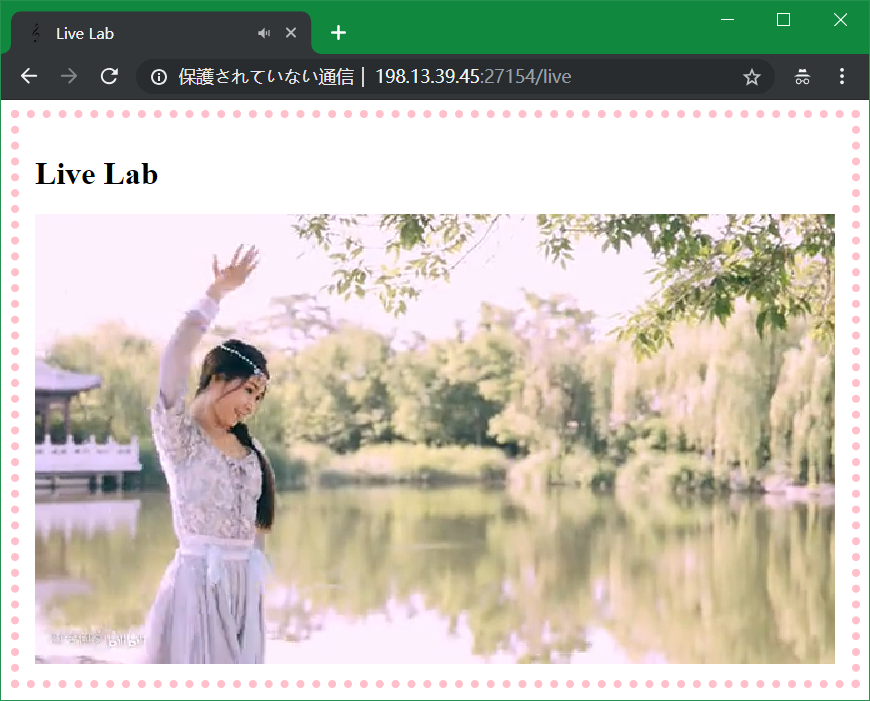

2018 年秋，我选修了《Linux 原理与应用》这门课程。在课程中，老师布置了几项作业，让我们从中选择一项完成。我选择了搭建直播服务器这项作业。在完成作业的过程中，我通过查找资料，学习到了 Linux、直播技术、服务器等方面的许多知识，并使用两种方法分别完成了任务。

# 使用 Nginx 搭建直播服务器

## 实验设计

我使用的是配置了 [MSYS2](http://www.msys2.org/) 环境的 Windows 10 操作系统，并使用 [Oracle VM VirtualBox](https://www.virtualbox.org/) 虚拟机安装了 Linux openSUSE 操作系统。

我计划完成的具体内容如下：

* 在 Linux 上使用 Nginx 搭建直播服务器
* 使用 Windows 系统模拟主播和观众进行推流和拉流
* 主播使用 FFmpeg 将视频流推送到服务器指定端口
* 观众从服务器指定端口获取直播视频数据，在浏览器中播放视频

经过查找资料，我发现：直播协议可以选择 RTMP 或 HLS，但 RTMP 是 Adobe 的私有协议，无法直接在很多设备上播放[^1]。经过考虑，我选择了 HLS 协议。但实际上，在配置 Nginx 服务器时，仍要在 RTMP 协议的基础上进行配置[^3]。

## 实验步骤

### 软件要求

**主机：**[FFmpeg](http://www.ffmpeg.org/download.html), Mozilla Firefox（或其他浏览器）

**虚拟机：**libpcre, OpenSSL, zlib

由于我已经在虚拟机中安装过 libpcre 和 zlib，因此这两个程序不需要额外安装；另外，在 openSUSE 系统中，`OpenSSL` 可以使用 `zypper install libopenssl-devel` 安装[^2]。

### 配置 IP 地址

在 Windows 操作系统上，使用 `ipconfig` 命令查看网络信息，得到与虚拟机相关的网卡 `Ethernet adapter VirtualBox Host-Only Network #3` 的 IP 地址为 192.168.56.1，子网掩码为 255.255.255.0。

根据以上信息，可以在 Oracle VM VirtualBox 中对虚拟机进行如下配置[^7]：


同时，需要在 Linux 中手动配置网络。我将 IP 地址设置为 192.168.56.9，子网掩码设置为 255.255.255.0，这是为了与主机在同一子网中；另外，将网络设备设置开机时即启用，避免手动开启设备。

### 编译安装 Nginx

使用如下命令编译和安装 Nginx[^3]：

```sh
cd ~
wget http://nginx.org/download/nginx-1.15.5.tar.gz
wget https://github.com/sergey-dryabzhinsky/nginx-rtmp-module/archive/dev.zip
tar -zxvf nginx-1.15.5.tar.gz
unzip dev.zip
cd nginx-1.15.1
CC=clang ./configure --with-http_ssl_module --add-module=../nginx-rtmp-module-dev
make -j8
sudo make install
```

最初在使用 `configure` 命令时，没有指定 `CC=clang`，系统默认的编译器为 GCC 8.2.1，出现了一些编译错误，使得编译失败。我还没有能力通过解决修改源代码的方式解决这些错误，但是想到该错误可能与编译器有关，于是指定 `CC=clang`，将编译器改为 Clang 6.0.1，成功编译。

`make` 命令的 `-j8` 参数是使用 8 线程编译，以加快编译速度。

### 修改配置文件

打开 `/usr/local/nginx/conf/nginx.conf`。

**修改 `http` -> `server` 块中的 `server_name`**[^4]

修改前：

```conf
server_name  localhost;
```

修改后：

```conf
server_name  localhost 192.168.56.9 192.168.56.1;
```

**在 `http` -> `server` 块中加入如下内容**[^4]

```conf
location /hls {
    # Disable cache
    add_header Cache-Control no-cache;
 
    # CORS setup
    add_header 'Access-Control-Allow-Origin' '*' always;
    add_header 'Access-Control-Expose-Headers' 'Content-Length';
 
    # allow CORS preflight requests
    if ($request_method = 'OPTIONS') {
        add_header 'Access-Control-Allow-Origin' '*';
        add_header 'Access-Control-Max-Age' 1728000;
        add_header 'Content-Type' 'text/plain charset=UTF-8';
        add_header 'Content-Length' 0;
        return 204;
    }
 
    types {
        application/vnd.apple.mpegurl m3u8;
        video/mp2t ts;
    }
 
    root /tmp/;
    add_header Cache-Control no-cache;
}
```

**在 `http` 块后加入如下内容**[^4][^5]

```conf
rtmp {
    server {
        listen 1935;
        chunk_size 4096;

        application live {
            live on;
            record off;

            hls on;
            hls_path /tmp/hls;
            hls_fragment 3;
            hls_playlist_length 20;
        }
    }
}
```

### 在 Linux 上运行服务器

**使用如下命令运行 Nginx 服务器**[^3]

```sh
sudo /usr/local/nginx/sbin/nginx
```

备注：修改了 Nginx 的配置文件后，重新加载配置文件的命令是 `sudo /usr/local/nginx/sbin/nginx -s reload`。

**关闭防火墙**[^6]

```sh
sudo iptables -F
```

起初没有在 Linux 中关闭防火墙，结果使用主机可以 ping 通虚拟机，但程序无法正常通信。

### 在 Windows 上推流

设视频文件的存储位置是 `/g/share/streams/24599937/1/24599937_1_0.flv`。

在 Bash 环境中输入如下命令：

```sh
ffmpeg -re -i '/g/share/streams/24599937/1/24599937_1_0.flv' -vcodec libx264 -vprofile baseline -acodec aac -strict -2 -f flv rtmp://192.168.56.9:1935/live/live
```

### 在 Windows 上拉流

新建文件 `video.html`，输入如下内容：

``` html
<!DOCTYPE html>
<html lang="zh-CN">
<head>
  <meta charset="utf-8" />
  <title>直播实验室</title>
  <script src="https://unpkg.com/video.js/dist/video.min.js"></script>
  <link href="https://unpkg.com/video.js/dist/video-js.min.css" rel="stylesheet" />
</head>
<body>
  <h1>直播实验室</h1>
  <video class="video-js" controls autoplay="true" width="640" data-setup="{}">
    <source src="http://192.168.56.9:8080/hls/live.m3u8" type="application/vnd.apple.mpegurl" />
  </video>
</body>
</html>
```

使用 Mozilla Firefox 浏览器中打开该文件，即可查看视频。

其中，视频的播放由 [Video.js](https://videojs.com/) 完成。

## 实验结果

视频成功播放。


# 使用 Haskell 实现直播服务器

## 实验设计

在成功搭建上述直播服务器后，我经过思考，认为轮播服务器对我更加实用。

在原来的直播服务器中，有三种角色：主播、服务器端和观众；而轮播服务器中，只有服务器端和观众两种角色，服务器端预先存储固定的几个视频并循环播放，用户观看视频时如同直播一样，不能在视频流上移动。这样做使用的是直播协议，可以模拟直播间的效果，而且可以精心挑选想要播放的视频，使用服务器持续播放。

为了实现这样的轮播服务器，我参考了直播协议 RFC 8216[^8]。直播时，客户端会不断请求 `*.m3u8` 文件，检查列表中是否有新的 `*.ts` 视频切片。经过学习后[^8][^10][^11][^12][^13]，我决定使用 Haskell 实现轮播服务器。

我计划完成的具体内容如下：

* 预先使用 FFmpeg 将 `*.flv` 格式的视频切片，转换为 `*.ts` 格式的视频和播放列表文件 `playlist.m3u8`
* 将多个已经切片的视频放置在服务器指定的文件夹中
* 运行服务器后，用户使用指定的 URI 向服务器请求动态生成的 `playlist.m3u8` 文件，并通过文件中提供的 URI 向服务器请求视频片段
* 观众在浏览器中播放视频
* 部署在个人服务器上测试

## 实验步骤

### 软件要求

**本地：**[FFmpeg](http://www.ffmpeg.org/download.html)

**个人服务器：**[Stack](https://www.haskellstack.org)

### 视频切片

设有两个视频文件，存储的位置分别是 `/g/share/streams/30088402/1/30088402_1_0.flv` 和 `/g/share/streams/24599937/1/24599937_1_0.flv`。

```sh
mkdir 30088402
ffmpeg -i /g/share/streams/30088402/1/30088402_1_0.flv -c copy -map 0 -f segment -segment_list 30088402/playlist.m3u8 -segment_time 10 30088402/output%03d.ts
mkdir 24599937
ffmpeg -i /g/share/streams/24599937/1/24599937_1_0.flv -c copy -map 0 -f segment -segment_list 24599937/playlist.m3u8 -segment_time 10 24599937/output%03d.ts
```

执行上述命令后[^9]，会在当前文件夹下产生如下文件：

```tree
.
├───24599937
│       output000.ts
│       output001.ts
|       ...
│       output024.ts
│       playlist.m3u8
│
└───30088402
        output000.ts
        output001.ts
        ...
        output020.ts
        playlist.m3u8
```

### 实现服务器

服务器的大致原理如下：

* 视频片段文件作为静态文件
* 服务器启动时读取所有播放列表文件，并将所有播放列表合并，存储在内存中
* 当用户请求播放列表时，服务器根据服务器已运行时间，动态生成当前时间对应的播放列表

服务器使用 Haskell 语言中的 Yesod Web 框架实现。Haskell 语言具有语法简洁的特点，最终的源代码仅有 183 行。

我经过查找资料发现，虽然有许多人与我一样实现了简单的 HLS 服务器，但是多数使用的是 Python 等编程语言，尚无人使用 Haskell 实现 HLS 服务器。本次实验可以视作在此方面的一次尝试。

### 运行服务器

将切片后生成的文件放置在个人服务器的 `prista/hls` 目录中（可以自行定义），同时在 `src/Main.hs` 中，设置 `readAndMergePlayListFiles` 函数的参数为 `"prista/hls"`。

使用 Stack 编译和运行服务器。典型的运行方式如下：

```sh
stack build
stack exec -- hls-simple
```

## 实验结果

使用同样的方法请求个人服务器根目录的 `playlist.m3u8` 文件，获得正确的播放列表：

``` m3u8
EXTM3U
EXT-X-VERSION:3
EXT-X-MEDIA-SEQUENCE:19
EXT-X-TARGETDURATION:19
EXTINF:7.6,
prista/hls/24599937/output019.ts
EXTINF:8.9,
prista/hls/24599937/output020.ts
EXTINF:11.1,
prista/hls/24599937/output021.ts
EXTINF:10.65,
prista/hls/24599937/output022.ts
EXTINF:7.0,
prista/hls/24599937/output023.ts
EXTINF:4.65,
prista/hls/24599937/output024.ts
EXT-X-DISCONTINUITY
EXTINF:11.832,
prista/hls/30088402/output000.ts
EXTINF:14.291,
prista/hls/30088402/output001.ts
EXTINF:7.832,
prista/hls/30088402/output002.ts
EXTINF:8.374,
prista/hls/30088402/output003.ts
EXTINF:10.374,
prista/hls/30088402/output004.ts
EXTINF:9.999,
prista/hls/30088402/output005.ts
EXTINF:9.999,
prista/hls/30088402/output006.ts
EXTINF:9.999,
prista/hls/30088402/output007.ts
EXTINF:7.999,
prista/hls/30088402/output008.ts
EXTINF:9.999,
prista/hls/30088402/output009.ts
```

在电脑浏览器中，视频文件正常播放：



在手机浏览器中，视频文件也能正常播放：


[源代码](https://github.com/ayaka14732/hls-simple)

[^1]: Zac波. RTMP HLS HTTP 直播协议一次看个够[EB/OL]. https://www.jianshu.com/p/4c89b2c83e59.

[^2]: xinwenfei. opensuse下遭遇openssl/aes.h: No such file or directory解决办法[EB/OL]. https://blog.csdn.net/xinwenfei/article/details/50777289.

[^3]: dodgepong. How to set up your own private RTMP server using nginx[EB/OL]. https://obsproject.com/forum/resources/how-to-set-up-your-own-private-rtmp-server-using-nginx.50/.

[^4]: cuishiying. 搭建HLS直播测试环境[EB/OL]. https://blog.csdn.net/cuishiying/article/details/78579108.

[^5]: nginx-rtmp-module. Directives[EB/OL]. https://github.com/arut/nginx-rtmp-module/wiki/Directives.

[^6]: davids_3233. [nginx] 在 Linux 服务器上部署 nginx 之后不能访问[EB/OL]. https://blog.csdn.net/lipeigang1109/article/details/73295373.

[^7]: 风吹过的时光. VirtualBox Host-only理解与实践[EB/OL]. https://blog.csdn.net/hzhsan/article/details/45224371.

[^8]: RFC 8216, HTTP Live Streaming[S]. R. Pantos, Ed., W. May, 2017.

[^9]: Jerry_Insist. 利用ffmepg把ts文件转m3u8并切片[EB/OL]. https://blog.csdn.net/zhangjiarui130/article/details/51691221.

[^10]: lucpp. [原创]直播服务器简单实现 http_flv和hls 内网直播桌面[EB/OL]. http://www.cnblogs.com/luconsole/p/6079534.html.

[^11]: xiaojun11-. HLS实现点播和直播时，M3U8文件的不同[EB/OL]. https://blog.csdn.net/xiaojun111111/article/details/52102454.

[^12]: Apple Developer Documentation. Live Playlist (Sliding Window) Construction[EB/OL]. https://developer.apple.com/documentation/http_live_streaming/example_playlists_for_http_live_streaming/live_playlist_sliding_window_construction.

[^13]: Michael Snoyman. Developing Web Apps with Haskell and Yesod[M]. 2nd Edition. O'Reilly, 2015.
