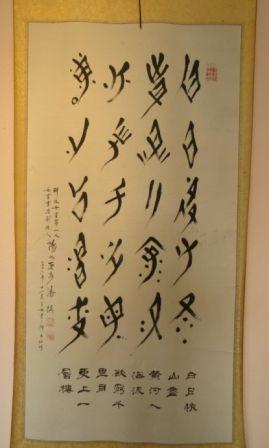
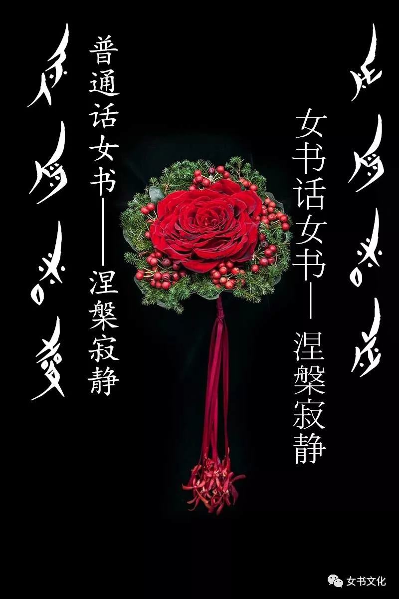
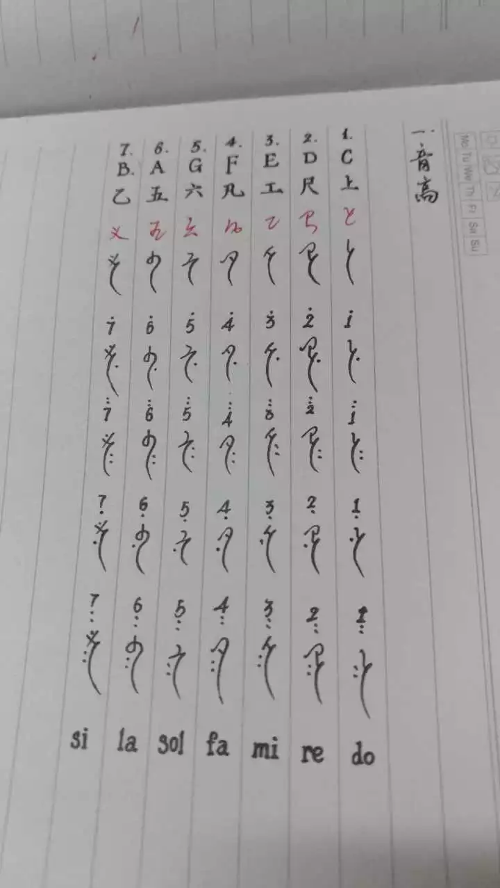
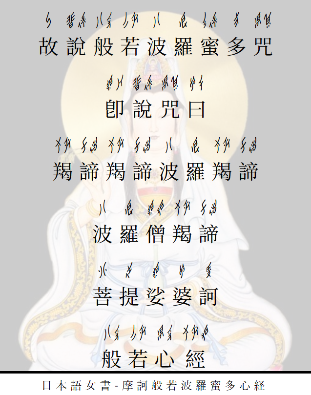

From Nushu to _Putonghua_ Nushu, and eventually the world of Nushu.

# Nushu

[Nushu](https://en.wikipedia.org/wiki/Nushu) is a mysterious script that was used exclusively among women in Jiangyong County of southern China.

The script could be categorized as a [syllabic script](https://en.wikipedia.org/wiki/Syllabary), since every character of it represents either a syllable or a group of syllables that share similar pronunciations. As it was used to record the Jiangyong dialect, a Chinese dialect different from standard Chinese (i.e. [_Putonghua_](https://en.wikipedia.org/wiki/Standard_Chinese)), every learner, if not being native Jiangyong dialect speaker, needs to learn the dialect, which could be difficult in the beginning.

# _Putonghua_ Nushu

Observing this obstacle, an individual Nushu researcher published [_Putonghua_ Nushu](https://mp.weixin.qq.com/s/puWEiNnY-5DvAg5DcLEYfQ) in April 2019. Based on the traditional Nushu script, it standardized the usage of the characters in terms of the syllables of _Putonghua_, with the motivation of creating a new kind of  Nushu which is easily accessible for all Chinese people.

Image source: [Nushu Culture](https://mp.weixin.qq.com/s/4AEoe5nCPRNuWSXBTCeBdQ)

# Nushu for _Gongche_ notation

It is not the first time that Nushu was used without the engagement of its original dialect. In March 2019, a [scheme](https://mp.weixin.qq.com/s/vY24yXhbbS_PGPHR53KvvQ) was posted on the subscription account of Nushu Culture, in which the author designed a new [_Gongche_ notation](https://en.wikipedia.org/wiki/Gongche_notation) in Nushu style. Combining Nushu and traditional Chinese Music, it is an innovative attempt to enrich the usage of the script.

# Japanese Nushu

Inspired by the two attempts, we have found that the usage of Nushu should not be restricted to the Chinese language and Chinese culture. Rather, it should be introduced to the whole world. The first station of our tour is the Japanese language.

In Japanese, there is a complete system of the pronunciation of Chinese characters called [_on'yomi_](https://en.wikipedia.org/wiki/Kanji#On'yomi_(Sino-Japanese_reading)). Therefore, using the same approach as _Putonghua_ Nushu, we could easily define Japanese Nushu as the following.

| Old Japanese | _Hiragana_ | _Man'yōgana_ | Living Example | Transcript of Example | Alternate | Nushu |
| ------------ | ---------- | ------------ | -------------- | ---------------------- | --------- | ------- |
| [a]{lang=ja-Latn} | [あ]{lang=ja-Hira} | [安]{lang=ja} | [安居院]{lang=ja} | [**_a_**gu-wi]{lang=ja-Latn} | [安]{lang=zh-CN} | [𛊃]{lang=zh-Nshu} |
| [i]{lang=ja-Latn} | [い]{lang=ja-Hira} | [移]{lang=ja} | [移染]{lang=ja} | [**_i_**-sen]{lang=ja-Latn} | [移]{lang=zh-CN} | [𛊺]{lang=zh-Nshu} |
| [u]{lang=ja-Latn} | [う]{lang=ja-Hira} | [有]{lang=ja} | [有頂天]{lang=ja} | [**_u_**tiyau-ten]{lang=ja-Latn} | [有]{lang=zh-CN} | [𛈶]{lang=zh-Nshu} |
| [e]{lang=ja-Latn} | [え]{lang=ja-Hira} | [衣]{lang=ja} | [衣紋家]{lang=ja} | [**_e_**mon-ke]{lang=ja-Latn} | [衣]{lang=zh-CN} | [𛆱]{lang=zh-Nshu} |
| [o]{lang=ja-Latn} | [お]{lang=ja-Hira} | [意]{lang=ja} | [意富比垝]{lang=ja} | [**_o_**popiko]{lang=ja-Latn} | [意]{lang=zh-CN} | [𛋤]{lang=zh-Nshu} |
| [ka]{lang=ja-Latn} | [か]{lang=ja-Hira} | [香]{lang=ja} | [香具山]{lang=ja} | [**_ka_**gu-yama]{lang=ja-Latn} | [香]{lang=zh-CN} | [𛉶]{lang=zh-Nshu} |
| [ki]{lang=ja-Latn} | [き]{lang=ja-Hira} | [来]{lang=ja} | [来手]{lang=ja} | [**_ki_**-te]{lang=ja-Latn} | [来]{lang=zh-CN} | [𛇤]{lang=zh-Nshu} |
| [ku]{lang=ja-Latn} | [く]{lang=ja-Hira} | [九]{lang=ja} | [九年母]{lang=ja} | [**_ku_**nen-bo]{lang=ja-Latn} | [九]{lang=zh-CN} | [𛆆]{lang=zh-Nshu} |
| [ke]{lang=ja-Latn} | [け]{lang=ja-Hira} | [家]{lang=ja} | [家来]{lang=ja} | [**_ke_**-rai]{lang=ja-Latn} | [家]{lang=zh-CN} | [𛉊]{lang=zh-Nshu} |
| [ko]{lang=ja-Latn} | [こ]{lang=ja-Hira} | [己]{lang=ja} | [己心]{lang=ja} | [**_ko_**-sin]{lang=ja-Latn} | [己]{lang=zh-CN} | [𛆺]{lang=zh-Nshu} |
| [ga]{lang=ja-Latn} | [が]{lang=ja-Hira} | [我]{lang=ja} | [我他彼此]{lang=ja} | [**_ga_**ta-pisi]{lang=ja-Latn} | [我]{lang=zh-CN} | [𛈪]{lang=zh-Nshu} |
| [gi]{lang=ja-Latn} | [ぎ]{lang=ja-Hira} | [義]{lang=ja} | [義認]{lang=ja} | [**_gi_**-nin]{lang=ja-Latn} | [义]{lang=zh-CN} | [𛅺]{lang=zh-Nshu} |
| [gu]{lang=ja-Latn} | [ぐ]{lang=ja-Hira} | [遇]{lang=ja} | [値遇]{lang=ja} | [ti-**_gu_**]{lang=ja-Latn} | [**月**]{lang=zh-CN} | [𛇃]{lang=zh-Nshu} |
| [ge]{lang=ja-Latn} | [げ]{lang=ja-Hira} | [下]{lang=ja} | [下用櫃]{lang=ja} | [**_ge_**you-bitu]{lang=ja-Latn} | [下]{lang=zh-CN} | [𛅽]{lang=zh-Nshu} |
| [go]{lang=ja-Latn} | [ご]{lang=ja-Hira} | [後]{lang=ja} | [後夜]{lang=ja} | [**_go_**-ya]{lang=ja-Latn} | [**后**]{lang=zh-CN} | [𛇌]{lang=zh-Nshu} |
| [sa]{lang=ja-Latn} | [さ]{lang=ja-Hira} | [沙]{lang=ja} | [沙汰]{lang=ja} | [**_sa_**-ta]{lang=ja-Latn} | [沙]{lang=zh-CN} | [𛊾]{lang=zh-Nshu} |
| [si]{lang=ja-Latn} | [し]{lang=ja-Hira} | [思]{lang=ja} | [思案]{lang=ja} | [**_si_**-an]{lang=ja-Latn} | [思]{lang=zh-CN} | [𛊸]{lang=zh-Nshu} |
| [su]{lang=ja-Latn} | [す]{lang=ja-Hira} | [寸]{lang=ja} | [寸陰]{lang=ja} | [**_su_**n-in]{lang=ja-Latn} | [寸]{lang=zh-CN} | [𛆄]{lang=zh-Nshu} |
| [se]{lang=ja-Latn} | [せ]{lang=ja-Hira} | [背]{lang=ja} | [背旗]{lang=ja} | [**_se_**-bata]{lang=ja-Latn} | [背]{lang=zh-CN} | [𛋲]{lang=zh-Nshu} |
| [so]{lang=ja-Latn} | [そ]{lang=ja-Hira} | [祖]{lang=ja} | [祖師図]{lang=ja} | [**_so_**si-du]{lang=ja-Latn} | [祖]{lang=zh-CN} | [𛊽]{lang=zh-Nshu} |
| [za]{lang=ja-Latn} | [ざ]{lang=ja-Hira} | [謝]{lang=ja} | | | [谢]{lang=zh-CN} | [𛋮]{lang=zh-Nshu} |
| [zi]{lang=ja-Latn} | [じ]{lang=ja-Hira} | [仕]{lang=ja} | [仕丁]{lang=ja} | [**_zi_**-tiyau]{lang=ja-Latn} | [仕]{lang=zh-CN} | [𛆹]{lang=zh-Nshu} |
| [zu]{lang=ja-Latn} | [ず]{lang=ja-Hira} | [受]{lang=ja} | [受領]{lang=ja} | [**_zu_**-riyau]{lang=ja-Latn} | [**寿**]{lang=zh-CN} | [𛉬]{lang=zh-Nshu} |
| [ze]{lang=ja-Latn} | [ぜ]{lang=ja-Hira} | [是]{lang=ja} | [是生滅法]{lang=ja} | [**_ze_**siyau-metupopu]{lang=ja-Latn} | [**十**]{lang=zh-CN} | [𛅵]{lang=zh-Nshu} |
| [zo]{lang=ja-Latn} | [ぞ]{lang=ja-Hira} | [存]{lang=ja} | [存命不定]{lang=ja} | [**_zo_**nmei-pudiyau]{lang=ja-Latn} | | [𛊶]{lang=zh-Nshu} |
| [ta]{lang=ja-Latn} | [た]{lang=ja-Hira} | [太]{lang=ja} | [太郎月]{lang=ja} | [**_ta_**rau-duki]{lang=ja-Latn} | [太]{lang=zh-CN} | [𛆎]{lang=zh-Nshu} |
| [ti]{lang=ja-Latn} | [ち]{lang=ja-Hira} | [千]{lang=ja} | [千葉]{lang=ja} | [**_ti_**ba]{lang=ja-Latn} | [千]{lang=zh-CN} | [𛆉]{lang=zh-Nshu} |
| [tu]{lang=ja-Latn} | [つ]{lang=ja-Hira} | [通]{lang=ja} | [通障子]{lang=ja} | [**_tu_**-siyauzi]{lang=ja-Latn} | | [𛉭]{lang=zh-Nshu} |
| [te]{lang=ja-Latn} | [て]{lang=ja-Hira} | [天]{lang=ja} | [天幕]{lang=ja} | [**_te_**n-maku]{lang=ja-Latn} | [天]{lang=zh-CN} | [𛆤]{lang=zh-Nshu} |
| [to]{lang=ja-Latn} | [と]{lang=ja-Hira} | [等]{lang=ja} | [等閑]{lang=ja} | [**_to_**u-kan]{lang=ja-Latn} | [等]{lang=zh-CN} | [𛉠]{lang=zh-Nshu} |
| [na]{lang=ja-Latn} | [な]{lang=ja-Hira} | [七]{lang=ja} | [七座星]{lang=ja} | [**_na_**namasu-posi]{lang=ja-Latn} | [七]{lang=zh-CN} | [𛅲]{lang=zh-Nshu} |
| [ni]{lang=ja-Latn} | [に]{lang=ja-Hira} | [二]{lang=ja} | [二弦琴]{lang=ja} | [**_ni_**gen-kin]{lang=ja-Latn} | [二]{lang=zh-CN} | [𛅱]{lang=zh-Nshu} |
| [nu]{lang=ja-Latn} | [ぬ]{lang=ja-Hira} | [怒]{lang=ja} | [憤怒]{lang=ja} | [fun-**_nu_**]{lang=ja-Latn} | [**念**]{lang=zh-CN} | [𛈏]{lang=zh-Nshu} |
| [ne]{lang=ja-Latn} | [ね]{lang=ja-Hira} | [年]{lang=ja} | [年縞]{lang=ja} | [**_ne_**n-kau]{lang=ja-Latn} | [年]{lang=zh-CN} | [𛆥]{lang=zh-Nshu} |
| [no]{lang=ja-Latn} | [の]{lang=ja-Hira} | [乃]{lang=ja} | [乃木浜]{lang=ja} | [**_no_**gi-pama]{lang=ja-Latn} | [**尾**]{lang=zh-CN} | [𛊊]{lang=zh-Nshu} |
| [da]{lang=ja-Latn} | [だ]{lang=ja-Hira} | [大]{lang=ja} | [大太鼓]{lang=ja} | [**_da_**-daiko]{lang=ja-Latn} | [大]{lang=zh-CN} | [𛅻]{lang=zh-Nshu} |
| [di]{lang=ja-Latn} | [ぢ]{lang=ja-Hira} | [治]{lang=ja} | [治部省]{lang=ja} | [**_di_**bu-siyau]{lang=ja-Latn} | | [𛊝]{lang=zh-Nshu} |
| [du]{lang=ja-Latn} | [づ]{lang=ja-Hira} | [頭]{lang=ja} | [頭陀袋]{lang=ja} | [**_du_**da-bukuro]{lang=ja-Latn} | [头]{lang=zh-CN} | [𛇊]{lang=zh-Nshu} |
| [de]{lang=ja-Latn} | [で]{lang=ja-Hira} | [田]{lang=ja} | [田字草]{lang=ja} | [**_de_**nzi-sau]{lang=ja-Latn} | [田]{lang=zh-CN} | [𛋊]{lang=zh-Nshu} |
| [do]{lang=ja-Latn} | [ど]{lang=ja-Hira} | [土]{lang=ja} | [土風炉]{lang=ja} | [**_do_**-buro]{lang=ja-Latn} | [土]{lang=zh-CN} | [𛆀]{lang=zh-Nshu} |
| [pa]{lang=ja-Latn} | [は]{lang=ja-Hira} | [八]{lang=ja} | [八佾]{lang=ja} | [**_pa_**ti-itu]{lang=ja-Latn} | [八]{lang=zh-CN} | [𛅴]{lang=zh-Nshu} |
| [pi]{lang=ja-Latn} | [ひ]{lang=ja-Hira} | [日]{lang=ja} | [日陰]{lang=ja} | [**_pi_**-kage]{lang=ja-Latn} | [日]{lang=zh-CN} | [𛇈]{lang=zh-Nshu} |
| [pu]{lang=ja-Latn} | [ふ]{lang=ja-Hira} | [不]{lang=ja} | [不況]{lang=ja} | [**_pu_**-kiyau]{lang=ja-Latn} | [不]{lang=zh-CN} | [𛆳]{lang=zh-Nshu} |
| [pe]{lang=ja-Latn} | [へ]{lang=ja-Hira} | [辺]{lang=ja} | [辺波]{lang=ja} | [**_pe_**-nami]{lang=ja-Latn} | [边]{lang=zh-CN} | [𛇙]{lang=zh-Nshu} |
| [po]{lang=ja-Latn} | [ほ]{lang=ja-Hira} | [方]{lang=ja} | | | [方]{lang=zh-CN} | [𛆠]{lang=zh-Nshu} |
| [ba]{lang=ja-Latn} | [ば]{lang=ja-Hira} | [婆]{lang=ja} | [婆娑羅絵]{lang=ja} | [**_ba_**sara-we]{lang=ja-Latn} | [**步**]{lang=zh-CN} | [𛉖]{lang=zh-Nshu} |
| [bi]{lang=ja-Latn} | [び]{lang=ja-Hira} | [備]{lang=ja} | [備後絣]{lang=ja} | [**_bi_**ngo-gasuri]{lang=ja-Latn} | [备]{lang=zh-CN} | [𛊰]{lang=zh-Nshu} |
| [bu]{lang=ja-Latn} | [ぶ]{lang=ja-Hira} | [文]{lang=ja} | [文房具]{lang=ja} | [**_bu_**nbau-gu]{lang=ja-Latn} | [文]{lang=zh-CN} | [𛆂]{lang=zh-Nshu} |
| [be]{lang=ja-Latn} | [べ]{lang=ja-Hira} | [別]{lang=ja} | [別業]{lang=ja} | [**_be_**tu-gepu]{lang=ja-Latn} | [别]{lang=zh-CN} | [𛊎]{lang=zh-Nshu} |
| [bo]{lang=ja-Latn} | [ぼ]{lang=ja-Hira} | [番]{lang=ja} | | | [**非**]{lang=zh-CN} | [𛆌]{lang=zh-Nshu} |
| [ma]{lang=ja-Latn} | [ま]{lang=ja-Hira} | [前]{lang=ja} | [前相撲]{lang=ja} | [**_ma_**pe-zumapu]{lang=ja-Latn} | [前]{lang=zh-CN} | [𛋋]{lang=zh-Nshu} |
| [mi]{lang=ja-Latn} | [み]{lang=ja-Hira} | [三]{lang=ja} | [三日月]{lang=ja} | [**_mi_**ka-duki]{lang=ja-Latn} | [三]{lang=zh-CN} | [𛆊]{lang=zh-Nshu} |
| [mu]{lang=ja-Latn} | [む]{lang=ja-Hira} | [六]{lang=ja} | [六連星]{lang=ja} | [**_mu_**tura-bosi]{lang=ja-Latn} | [六]{lang=zh-CN} | [𛆜]{lang=zh-Nshu} |
| [me]{lang=ja-Latn} | [め]{lang=ja-Hira} | [女]{lang=ja} | [女波]{lang=ja} | [**_me_**-nami]{lang=ja-Latn} | [女]{lang=zh-CN} | [𛆁]{lang=zh-Nshu} |
| [mo]{lang=ja-Latn} | [も]{lang=ja-Hira} | [門]{lang=ja} | [門下]{lang=ja} | [**_mo_**n-ka]{lang=ja-Latn} | [门]{lang=zh-CN} | [𛇷]{lang=zh-Nshu} |
| [ya]{lang=ja-Latn} | [や]{lang=ja-Hira} | [夜]{lang=ja} | [夜天光]{lang=ja} | [**_ya_**ten-kuwau]{lang=ja-Latn} | [夜]{lang=zh-CN} | [𛇩]{lang=zh-Nshu} |
| [yu]{lang=ja-Latn} | [ゆ]{lang=ja-Hira} | [由]{lang=ja} | [由加物]{lang=ja} | [**_yu_**ka-mono]{lang=ja-Latn} | [**鱼**]{lang=zh-CN} | [𛊢]{lang=zh-Nshu} |
| [yo]{lang=ja-Latn} | [よ]{lang=ja-Hira} | [四]{lang=ja} | [四方棚]{lang=ja} | [**_yo_**pau-dana]{lang=ja-Latn} | [四]{lang=zh-CN} | [𛈗]{lang=zh-Nshu} |
| [ra]{lang=ja-Latn} | [ら]{lang=ja-Hira} | [良]{lang=ja} | [奈良]{lang=ja} | [na**_ra_**]{lang=ja-Latn} | [良]{lang=zh-CN} | [𛉴]{lang=zh-Nshu} |
| [ri]{lang=ja-Latn} | [り]{lang=ja-Hira} | [里]{lang=ja} | [里正]{lang=ja} | [**_ri_**-sei]{lang=ja-Latn} | [里]{lang=zh-CN} | [𛉄]{lang=zh-Nshu} |
| [ru]{lang=ja-Latn} | [る]{lang=ja-Hira} | [留]{lang=ja} | [留守番]{lang=ja} | [**_ru_**su-ban]{lang=ja-Latn} | [**刘**]{lang=zh-CN} | [𛇋]{lang=zh-Nshu} |
| [re]{lang=ja-Latn} | [れ]{lang=ja-Hira} | [連]{lang=ja} | [連理]{lang=ja} | [**_re_**n-ri]{lang=ja-Latn} | [连]{lang=zh-CN} | [𛉹]{lang=zh-Nshu} |
| [ro]{lang=ja-Latn} | [ろ]{lang=ja-Hira} | [路]{lang=ja} | [路考]{lang=ja} | [**_ro_**kau]{lang=ja-Latn} | [路]{lang=zh-CN} | [𛋗]{lang=zh-Nshu} |
| [wa]{lang=ja-Latn} | [わ]{lang=ja-Hira} | [和]{lang=ja} | [和綿]{lang=ja} | [**_wa_**-men]{lang=ja-Latn} | | [𛇮]{lang=zh-Nshu} |
| [wi]{lang=ja-Latn} | [ゐ]{lang=ja-Hira} | [為]{lang=ja} | [為政]{lang=ja} | [**_wi_**-sei]{lang=ja-Latn} | [为]{lang=zh-CN} | [𛊄]{lang=zh-Nshu} |
| [wo]{lang=ja-Latn} | [ゑ]{lang=ja-Hira} | [回]{lang=ja} | [回向文]{lang=ja} | [**_we_**kau-mon]{lang=ja-Latn} | [回]{lang=zh-CN} | [𛇳]{lang=zh-Nshu} |
| [wo]{lang=ja-Latn} | [を]{lang=ja-Hira} | [遠]{lang=ja} | [遠志]{lang=ja} | [**_wo_**n-zi]{lang=ja-Latn} | [远]{lang=zh-CN} | [𛋟]{lang=zh-Nshu} |
| [n]{lang=ja-Latn} | [ん]{lang=ja-Hira} | | | | [无]{lang=zh-CN} | [𛇯]{lang=zh-Nshu} |

Reference: [Wikipedia](https://en.wikipedia.org/wiki/Man%27y%C5%8Dgana)

Text source: [Wikisource](https://ja.wikisource.org/wiki/%E6%91%A9%E8%A8%B6%E8%88%AC%E8%8B%A5%E6%B3%A2%E7%BE%85%E8%9C%9C%E5%A4%9A%E5%BF%83%E7%B5%8C)

# The ultimate solution: BaseNushu

[Base64](https://en.wikipedia.org/wiki/Base64) is a group of binary-to-text encoding schemes that represent binary data in an ASCII string format by translating it into a radix-64 representation. It is designed to carry data stored in binary formats across channels that only reliably support text content.

For our Nushu world, it is expected that information could be represented by nothing else but Nushu. This is why BaseNushu comes in. Inspired by [BaseHangul](https://basehangul.github.io/), [Base256](https://github.com/Equim-chan/base256) and many other prominent projects, BaseNushu encodes every binary data into a radix-256 representation.

<form onsubmit="handleEncode(input.files[0]); return false">
  <fieldset>
    <legend>BaseNushu Encoder</legend>
    
<input type="file" id="input"/>

    
<output id="res" for="input"></output>

    
<input type="submit" value="Encode"/>

  </fieldset>
</form>

For example, the English sentence "To be, or not to be, that is the question.", when encoded in [UTF-8](https://en.wikipedia.org/wiki/UTF-8), is a binary serial `546f 2062 652c 206f 7220 6e6f 7420 746f 2062 652c 2074 6861 7420 6973 2074 6865 2071 7565 7374 696f 6e2e`, and it encodes to "[𛇄𛇟𛆐𛇒𛇕𛆜𛆐𛇟𛇢𛆐𛇞𛇟𛇤𛆐𛇤𛇟𛆐𛇒𛇕𛆜𛆐𛇤𛇘𛇑𛇤𛆐𛇙𛇣𛆐𛇤𛇘𛇕𛆐𛇡𛇥𛇕𛇣𛇤𛇙𛇟𛇞𛆞]{lang=zh-Nshu}".

Image source: [Stratford Festival](https://www.litcharts.com/blog/shakespeare/hamletssoliloquy/)

And the above emoji encodes to:

<pre lang="zh-Nshu">𛉯𛉈𛉯𛉐𛅰𛆀𛆺𛆶𛆹𛆶𛅰𛅱𛅱𛅰𛅰𛅱𛅰𛅱𛅰𛅰𛉯𛉋𛅰𛆳𛅰𛅵𛅳𛅴𛅴𛅴𛅳𛅵𛅴𛅴𛅴𛅵𛅵𛅵𛅶𛅷𛅼𛅸𛅷𛅷𛅷𛅷𛅿𛅻𛅻𛅹𛅼𛆁𛅿𛆂𛆂𛆁𛅿𛆁𛆁𛆃𛆆𛆌𛆇𛆃𛆄𛆊𛆅𛆁𛆁𛆈𛆑𛆈𛆊𛆍𛆍𛆏𛆏𛆏𛆃𛆇𛆒𛆔𛆒𛆎𛆔𛆌𛆎𛆏𛆎𛉯𛉋𛅰𛆳𛅱𛅵𛅵𛅵𛅷𛅶𛅷𛅾𛅸𛅸𛅾𛆎𛆄𛆁𛆄𛆎𛆎𛆎𛆎𛆎𛆎𛆎𛆎𛆎𛆎𛆎𛆎𛆎𛆎𛆎𛆎𛆎𛆎𛆎𛆎𛆎𛆎𛆎𛆎𛆎𛆎𛆎𛆎𛆎𛆎𛆎𛆎𛆎𛆎𛆎𛆎𛆎𛆎𛆎𛆎𛆎𛆎𛆎𛆎𛆎𛆎𛆎𛆎𛆎𛆎𛉯𛈰𛅰𛆁𛅸𛅰𛆠𛅰𛆠𛅳𛅱𛆒𛅰𛅲𛆁𛅱𛅳𛆁𛅱𛉯𛈴𛅰𛆊𛅰𛅰𛅳𛅰𛅳𛅱𛅰𛅰𛅰𛅰𛅰𛅰𛅰𛅰𛅰𛅰𛅰𛅵𛅶𛅷𛅱𛅳𛅸𛅴𛉯𛈴𛅰𛆰𛆀𛅰𛅱𛅳𛅲𛅳𛅵𛅲𛅸𛅺𛅻𛅰𛅰𛅰𛅰𛅰𛅰𛅳𛅲𛅴𛅵𛅶𛆃𛅰𛅱𛆂𛅷𛆄𛆒𛆓𛆲𛆅𛆢𛆁𛆣𛆳𛇂𛇃𛇣𛇳𛈓𛆑𛆔𛇑𛇒𛇓𛇲𛈃𛈣𛉃𛉠𛅸𛆆𛆡𛆤𛇄𛇡𛇢𛇱𛈲𛉂𛉒𛉯𛈴𛅰𛆈𛅱𛅱𛅱𛅱𛅱𛅱𛅰𛅰𛅰𛅰𛅰𛅰𛅰𛅰𛅰𛅰𛅰𛅴𛅵𛅳𛅶𛅰𛉯𛈴𛅰𛆏𛆁𛅰𛅱𛅴𛅲𛅳𛅱𛅱𛅰𛅰𛅰𛅰𛅰𛅰𛅰𛅰𛅰𛅲𛅰𛅱𛅳𛅴𛅵𛆂𛆁𛆑𛆒𛆡𛆃𛉯𛉊𛅰𛅼𛅳𛅱𛅰𛅲𛆁𛅳𛆁𛅰𛆯𛅰𛉜𛇌𛅴𛇧𛆐𛈽𛇳𛇇𛆾𛇎𛆬𛈢𛉍𛈮𛇊𛇼𛇓𛇙𛈧𛉩𛉞𛉐𛇭𛇝𛆫𛉪𛈩𛅷𛆑𛆜𛆶𛈧𛈧𛇐𛉌𛅾𛇊𛉬𛇡𛆪𛆷𛇴𛆴𛈲𛈂𛆵𛈯𛇘𛇆𛈾𛈅𛆐𛉑𛇙𛈨𛆶𛈺𛇂𛈄𛉅𛈗𛈡𛉚𛉮𛈜𛅲𛉅𛈐𛈞𛈦𛇶𛆏𛉁𛇝𛈘𛆦𛈉𛆇𛆯𛆻𛆮𛅵𛅾𛇙𛇙𛆗𛇴𛈺𛈻𛇇𛅽𛆒𛆍𛇖𛆍𛇎𛈪𛉅𛈬𛆖𛉄𛆿𛈚𛇚𛆜𛆞𛈇𛈍𛇅𛇈𛆕𛈊𛈅𛈖𛆬𛇝𛅲𛆇𛆓𛇙𛈹𛉟𛆪𛆣𛈐𛉪𛇜𛆪𛆤𛈋𛈙𛆗𛇅𛈉𛆙𛉊𛇝𛈓𛇸𛉎𛆋𛇟𛆏𛈮𛉍𛇶𛉗𛉄𛈖𛉁𛈬𛉌𛇩𛈃𛇅𛆩𛆴𛇷𛇓𛆆𛈋𛇣𛈅𛇅𛇞𛉗𛇕𛉔𛇐𛉣𛆷𛈛𛆽𛈻𛉎𛇿𛈗𛆂𛇾𛇙𛇦𛇓𛇑𛇋𛅸𛅳𛆗𛈺𛆪𛇩𛈌𛉔𛆐𛆏𛈣𛈀𛇻𛈀𛈿𛇵𛆞𛇺𛈴𛈹𛆠𛆴𛇟𛆙𛈵𛉭𛉣𛈳𛇗𛉝𛈴𛆁𛉡𛆛𛇊𛅾𛆹𛉅𛆺𛇪𛆩𛇰𛈑𛆎𛆚𛉔𛈞𛇁𛇂𛇇𛆼𛆜𛉭𛆗𛇺𛅾𛈜𛇋𛆈𛈩𛅳𛈑𛇵𛈸𛆹𛇠𛇕𛆍𛉑𛉮𛇮𛈦𛆜𛆳𛆙𛇬𛆳𛇃𛆪𛉡𛉋𛇙𛇺𛉝𛇻𛆕𛆑𛆚𛇕𛅰𛆂𛆮𛇧𛉐𛇇𛇺𛇣𛉍𛅿𛈩𛉎𛈡𛈖𛈣𛇋𛇩𛇊𛇒𛇚𛆅𛈫𛈰𛈕𛉣𛈦𛆴𛅸𛇃𛇣𛈚𛉏𛉫𛇐𛆵𛆺𛉙𛉜𛇭𛇛𛇍𛈶𛆖𛈾𛉤𛉕𛈓𛇉𛇘𛉤𛈕𛇙𛈨𛇑𛉋𛈣𛉧𛈱𛉧𛉈𛉖𛇼𛈍𛈪𛉎𛈧𛈽𛉘𛉙𛇥𛇫𛆌𛉭𛈱𛆩𛆖𛇗𛆕𛉇𛉑𛆡𛆝𛇞𛆧𛉤𛈪𛉢𛇹𛈁𛇼𛈘𛉦𛇠𛇚𛇗𛆗𛆍𛈆𛉨𛆡𛉫𛇻𛈱𛈐𛈹𛇁𛈋𛇢𛉝𛉌𛈴𛈛𛇔𛇷𛈗𛆦𛇭𛇅𛆶𛈣𛆽𛆸𛆹𛇸𛈦𛈡𛉞𛇲𛇙𛇥𛇼𛈉𛈦𛈸𛈖𛆠𛇝𛇾𛉧𛇻𛉞𛇵𛇏𛅿𛉂𛇓𛆥𛉔𛇜𛈴𛈵𛆇𛅵𛆘𛈊𛇦𛆪𛇉𛉀𛈣𛆉𛆍𛈔𛈽𛈟𛆃𛆑𛉙𛈰𛆰𛇅𛇺𛆤𛇚𛇽𛉈𛈰𛆐𛇪𛇢𛅼𛇰𛇝𛉫𛈿𛈱𛈲𛇳𛆑𛈰𛇠𛇴𛉨𛈰𛆃𛆞𛇍𛆯𛇆𛉀𛆠𛇁𛆋𛆵𛆦𛉂𛈇𛇅𛈁𛉆𛉧𛆈𛈖𛉝𛇑𛉂𛇔𛉬𛇣𛈃𛇟𛈇𛇲𛉫𛅶𛇮𛈈𛈻𛇤𛆳𛈹𛇔𛈻𛆉𛈤𛆻𛇣𛅼𛈺𛆢𛆻𛇛𛆿𛆜𛇳𛉪𛈬𛈏𛈤𛈴𛆾𛆮𛆪𛇁𛈅𛆉𛇁𛈻𛆡𛇷𛇿𛇖𛈹𛉁𛇷𛇗𛆦𛈽𛈜𛈁𛆹𛉢𛈌𛉟𛆷𛈲𛈟𛉩𛈱𛉯𛅰𛉁𛆝𛈞𛇔𛈟𛉌𛈨𛅰𛆾𛈀𛈦𛇼𛆕𛈳𛆛𛈫𛈘𛇴𛆏𛉐𛈙𛆮𛈿𛅾𛇶𛈾𛉖𛈬𛇈𛈈𛈶𛈡𛆹𛈢𛈪𛉝𛆢𛈁𛈾𛈒𛈽𛈋𛈨𛉗𛆻𛇺𛈍𛇾𛈾𛉓𛆗𛈙𛅽𛈽𛆭𛉞𛇉𛆢𛉚𛆏𛆆𛇏𛅷𛉣𛈴𛈧𛇕𛉁𛉠𛈥𛇻𛇢𛆾𛆬𛈕𛆊𛆷𛈸𛅸𛉌𛈵𛅵𛆌𛈃𛇭𛆐𛉡𛆿𛉊𛇋𛉖𛈷𛇄𛇕𛆠𛆲𛆀𛇔𛈎𛇁𛇲𛉒𛈺𛈤𛉬𛇌𛇙𛈨𛇞𛆟𛇧𛉝𛆅𛇰𛆃𛆲𛈓𛇽𛈁𛆊𛈭𛈆𛅳𛇡𛈦𛇟𛇔𛈰𛆼𛈙𛆋𛇽𛅹𛉩𛈳𛆹𛆂𛈎𛈞𛈜𛆹𛈺𛆿𛉛𛇆𛆷𛈷𛈺𛇡𛇿𛈇𛆲𛇒𛉚𛆊𛈉𛆛𛇄𛈲𛈓𛈍𛈻𛈶𛈌𛇾𛆳𛈩𛆢𛆀𛇞𛆤𛇀𛆽𛇜𛇬𛆺𛆒𛇥𛇚𛆺𛇄𛈕𛇧𛈨𛈂𛈍𛆮𛅴𛈛𛅴𛇒𛇓𛇙𛆊𛈍𛈃𛆩𛉖𛈠𛇡𛉖𛆻𛈜𛈥𛆔𛇻𛇖𛈄𛈙𛅺𛉚𛆺𛈬𛉅𛆕𛇌𛆭𛇌𛇈𛉁𛆽𛉅𛇄𛉪𛇢𛇌𛆝𛆏𛅾𛉦𛆽𛇻𛅴𛇘𛈭𛆊𛆡𛈙𛈚𛈅𛉎𛉂𛈃𛆘𛇹𛆺𛈅𛈵𛈙𛇈𛆕𛈣𛈦𛈿𛈉𛉃𛈊𛇕𛆉𛈙𛇹𛇺𛉝𛉋𛈌𛇱𛈉𛆂𛆵𛅵𛆖𛇠𛆲𛆕𛆚𛇂𛇮𛇚𛈬𛉜𛆹𛈋𛈐𛇧𛇮𛈍𛈂𛇦𛇤𛆦𛈫𛈚𛆉𛈵𛆈𛆠𛇑𛅼𛇢𛈎𛆩𛉮𛆟𛉧𛇀𛉪𛉜𛆣𛉜𛇺𛇻𛇕𛆸𛈴𛆨𛅸𛇌𛆍𛉓𛉗𛈴𛆹𛉏𛈊𛉈𛈵𛈘𛈎𛈗𛈹𛈗𛉔𛈲𛈾𛉆𛉓𛉉𛈆𛆅𛇃𛅵𛆅𛉔𛈶𛆚𛉑𛅳𛈇𛈅𛇛𛉍𛇤𛈏𛈡𛉫𛈌𛆤𛇜𛈁𛉪𛆧𛇙𛅺𛇭𛉃𛈭𛉘𛉁𛆞𛉤𛆓𛆢𛈕𛆧𛆂𛆒𛇕𛇨𛇯𛉔𛈏𛇗𛉢𛇒𛈶𛆄𛈻𛉚𛆅𛈣𛆧𛆍𛇇𛉯𛉉</pre>

This means that we have not only [_Putonghua_ Nushu](#putonghua-nushu), [Nushu for _Gongche_ notation](#nushu-for-gongche-notation) and [Japanese Nushu](#japanese-nushu), but also the whole gamut from English Nushu, Spanish Nushu and Russian Nushu (via UTF-8), to image Nushu, music Nushu and video Nushu.

Everything solved. This is the ultimate solution of Nushu.

(Written on May 5, 2019, fixed typo on May 20, 2019 and May 1, 2020)
