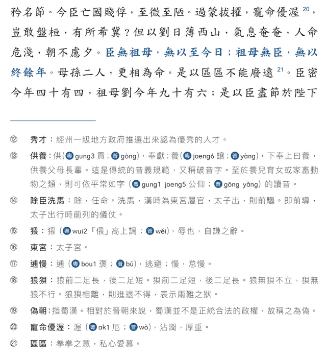

與直音相比，反切的優勢有二。

其一，它對語音系統的分析更為透徹。例如「公」字，註直音為「工」，註反切為「古紅切」。反切能説明「公」字是由「古」字的聲母與「紅」字的韻母拼合而成的，而直音則做不到這一點。

其二，與直音相比，反切可以較少地使用生僻字，從而更易拼讀。如「秋」字，《康熙字典》註直音「鰌」，註反切為「七由切」。由於「秋」字是其同音字中最常見者，所以若註直音，衹能以生僻字「鰌」註音；而反切則可以將該字分析為兩個常見字「七」與「由」。雖然反切亦有生僻字切非生僻字之例，如《廣韻》「追」註反切為「陟隹切」、「豈」註反切為「袪狶切」、「轉」註反切為「陟兖切」、「寨」註反切為「犲夬切」，也不易拼讀，但這樣的例子畢竟較少，且與直音相比，反切選字的餘地更大。

與反切相比，直音的優勢有三。

其一，直音更容易理解。《顔氏家訓》中提到「高貴鄉公（曹髦）不解反語，以為怪異」，説明反切更難掌握，也不太自然。

其二，反切本身存在一定的不精確性，不能很好地處理介音問題。

如《廣韻》「格」註反切為「古伯切」，「虢」註反切亦為「古伯切」。而在《韻鏡》中，二字有開合之別，「格」位於外轉第三十三開，「虢」位於外轉第三十四合。同理，《廣韻》「汻」註反切為「呼朗切」，「荒」註反切為「呼浪切」。《韻鏡》中反切下字「朗」與「浪」都位於内轉第三十一開，僅聲調有別，而被切字「汻」字位於内轉第三十一開，「荒」字位於内轉第三十二合，還有開合之別。

由於反切上字「古」、「呼」屬模韻，這可能是由於創造上述幾個反切時，模韻的主要元音為 [\[u\]]{lang=en-fonipa}；或採納《[unt]{lang=en-HK} 切韻朗讀音》的觀點，認為模韻是 [\[u\]]{lang=en-fonipa} 與 [\[o\]]{lang=en-fonipa} 的雙重調音：格 [\[qɻac˥\]]{lang=en-fonipa}，虢 [\[qwɻac˥\]]{lang=en-fonipa}，古伯 [\[qu͡o˦˦˥ pɻac˥\]]{lang=en-fonipa}。這説明反切上字的韻腹存在 [\[u\]]{lang=en-fonipa} 時，被切字是否存在 [\[w\]]{lang=en-fonipa} 介音是無法確定的。

其三，直音往往可以直接適用於後世，而反切則需要特殊的拼讀規則。如「弓」為「居戎切」，以今普通話讀，聲母、聲調都要改變，方能切得正確發音；而如果註直音「宮」，則與今普通話完全相合。這是因為聲、韻、調均相同的字演化規律往往相同；而若聲母相同、韻母不同，則後世聲母可能受韻母的影響産生差異。

雖然也有一些字，古代的音韻地位相同，而現代讀音有別，例如「躇」，《康熙字典》註直音「除」，且《廣韻》中「躇」、「除」同音，但在今粵語廣州話中，「躇」音 [cyu4]{lang=yue-Latn} [\[t͡sʰyː˨˩\]]{lang=en-fonipa}，「除」音 [ceoi4]{lang=yue-Latn} [\[t͡sʰɵy˨˩\]]{lang=en-fonipa}，二者並不同音。普遍認為這是由於「除」字的 [\[y\]]{lang=en-fonipa} 進一步裂化為 [\[ɵy\]]{lang=en-fonipa}，而「躇」字的 [\[y\]]{lang=en-fonipa} 保持早期粵語的讀法不變。但這樣的例子畢竟少見，而反切不合的例子則十分常見。

現代有了拼音以後，反切與直音的注音方式就少見了，我認為這是因為拼音簡單易學，且含義清晰，能夠避免多音字的問題。

反切不能避免多音字的問題，如《廣韻》「勥」註反切為「其兩切」，但反切上字「其」有見母、羣母二讀；

直音不能避免多音字的問題，如《康熙字典》「躇」註直音「除」，但《廣韻》中「除」字有「直魚切」與「遟倨切」二讀。

在拼音没有推廣的地區，直音仍然是面向大眾的書籍最常用的註音方式。例如粵語拼音在香港民間尚不流行，香港出版的《中學生文言經典選讀：古文觀止》中，《陳情表》一文「逋」字的粵語讀音除註粵語拼音 [bou1]{lang=yue-Latn} 外，還額外註直音「褒」，而普通話讀音僅註 [bū]{lang=cmn-Latn}，不註直音；「猥」字除註粵語拼音 [wui2]{lang=yue-Latn} 外，還額外註「『偎』高上調」，而普通話讀音僅註 [wěi]{lang=cmn-Latn}，不註直音。

有一篇面向香港普通大眾的文章，在註音時普遍採用直音，但在描述「傳」的粵語音 [zyun6]{lang=yue-Latn} 時，由於註直音的字較為生僻，還額外寫出「試將『住願』二字快讀便知」。因為「住」粵語音 [zyu6]{lang=yue-Latn}，「願」粵語音 [jyun6]{lang=yue-Latn}，快讀就成為 [zyun6]{lang=yue-Latn}，這與反切的原理十分接近。從此例也可以看出，對普通大眾而言，反切有一定的閲讀負擔，没有直音簡便，不在迫不得已時並不使用；而如果拼音已經流行，則使用拼音是最好的註音方式。

（作於 2020&#8239;年&#8239;3&#8239;月&#8239;26&#8239;日，原為音韻學課程思考題）
